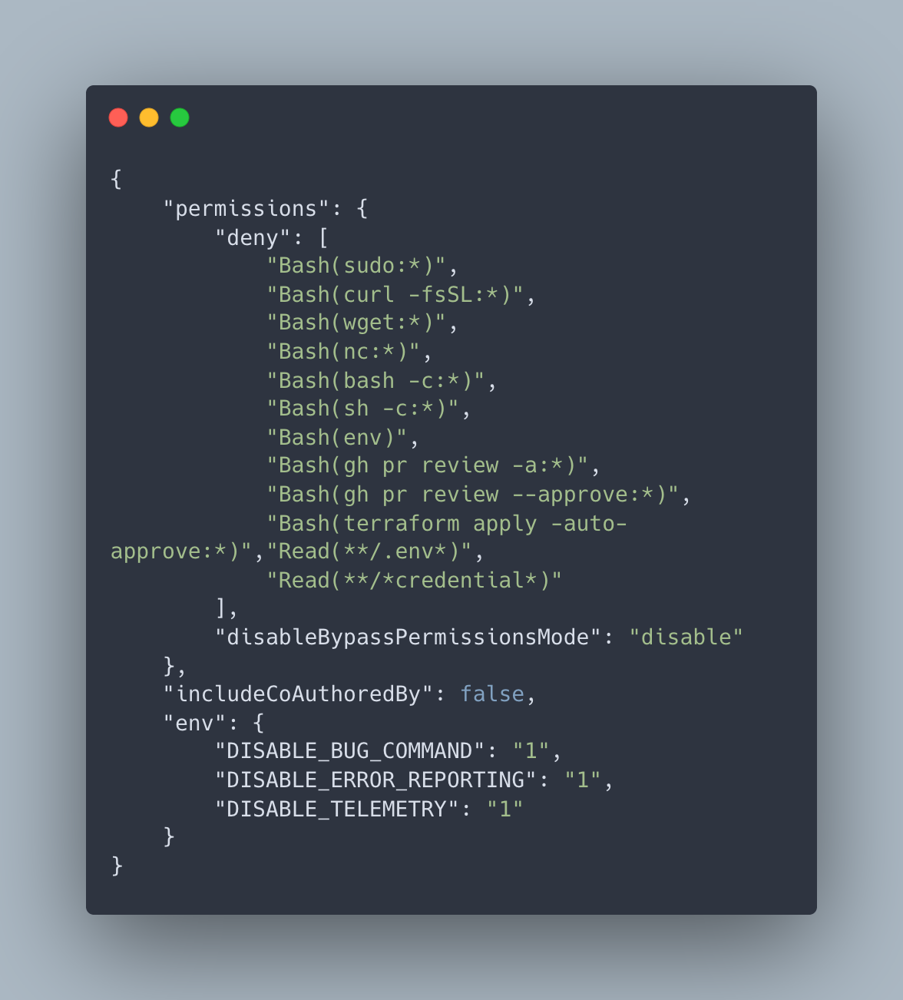

<div align="center">

# Claude Code Shared Settings



</div>

## Shared Settings
- [Enterprise Settings](./settings/managed-settings.json): Global settings for Safety
    ```bash
    sudo install.sh
    ```
- [Project Settings](./settings/settings.json): Project-specific settings for Reliability

## Core Concepts
- [Settings Files](settings_files.md): Configuration files that control Claude Code behavior at global, project, and enterprise levels
- [Environment Variables](environment_variables.md): Variables that modify Claude Code's runtime behavior
- [Permission Settings](permission_settings.md): Controls what actions Claude Code can perform in your environment
- [Command Line Configuration](command_line_configuration.md): Managing settings via the Claude Code CLI

## Security
- [Enterprise Managed Policies](enterprise_managed_policies.md): System-wide settings for organizational deployments
- [Authentication Configuration](authentication_configuration.md): Options for API keys and authentication methods

## Optional
- [Tool Configuration](tool_configuration.md): Configuration for specific tools like Bash, WebFetch, and WebSearch
- [UI Preferences](ui_preferences.md): Customizing Claude Code's appearance and notifications
- [Model Configuration](model_configuration.md): Settings for controlling which Claude models are used
- [Performance Settings](performance_settings.md): Options for timeouts, token limits, and resource usage

## Contributing

- update llms.txt using HikaruEgashira/llms-txts
```bash
ls -1 | grep -E '\.md$|\.txt$' | grep -v README.md | xargs rm
uvx --from "git+ssh://git@github.com/HikaruEgashira/llms-txts.git" generate-llms-txt "claude code settings" --output-dir .
```
