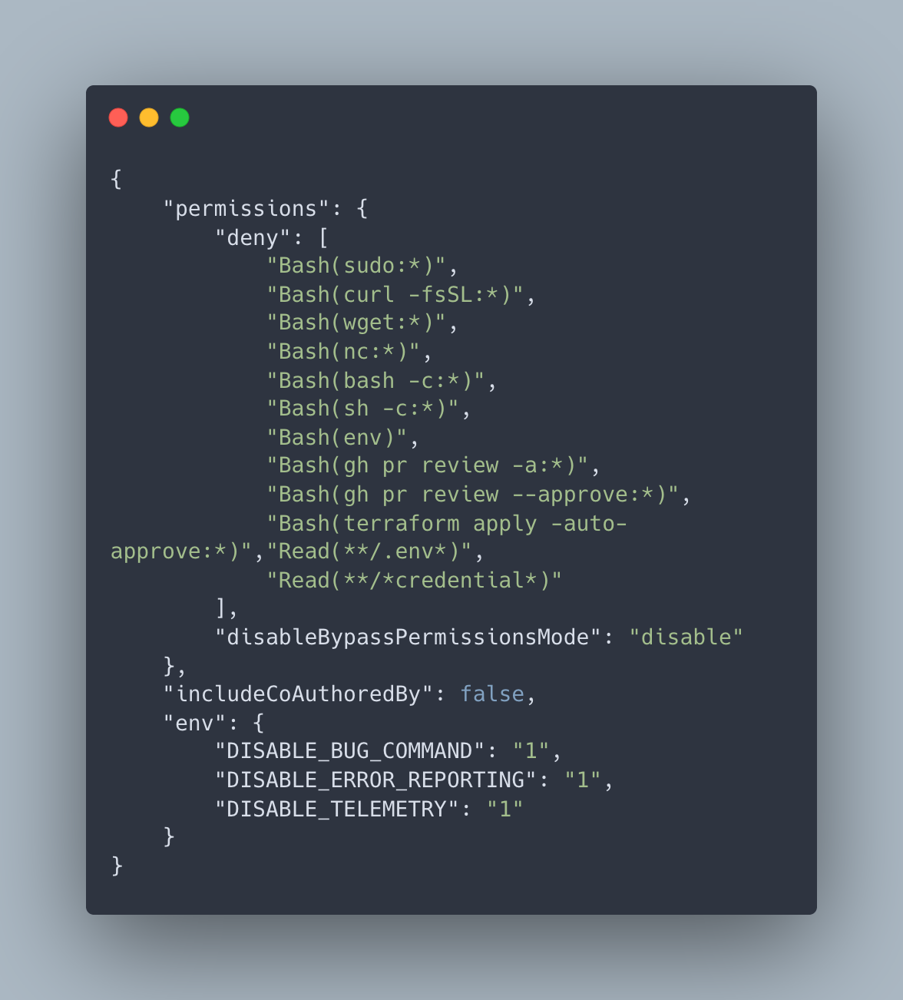

<div align="center">

# Claude Code 共通設定

**[English](../README.md)** | **[日本語](README.md)**



</div>

## 共通設定
- [エンタープライズ設定](../settings/managed-settings.json): セーフティのためのグローバル設定
    ```bash
    sudo install.sh
    ```
- [プロジェクト設定](../settings/settings.json): 信頼性のためのプロジェクト固有設定

## 主要概念
- [設定ファイル](settings_files.md): グローバル、プロジェクト、エンタープライズレベルでClaude Codeの動作を制御する設定ファイル
- [環境変数](environment_variables.md): Claude Codeの実行時動作を変更する変数
- [権限設定](permission_settings.md): Claude Codeが環境で実行できるアクションを制御
- [コマンドライン設定](command_line_configuration.md): Claude Code CLIを介した設定管理

## セキュリティ
- [エンタープライズ管理ポリシー](enterprise_managed_policies.md): 組織デプロイメント用のシステム全体設定
- [認証設定](authentication_configuration.md): APIキーと認証方法のオプション

## オプション
- [ツール設定](tool_configuration.md): Bash、WebFetch、WebSearchなどの特定ツールの設定
- [UI設定](ui_preferences.md): Claude Codeの外観と通知のカスタマイズ
- [モデル設定](model_configuration.md): 使用するClaudeモデルを制御する設定
- [パフォーマンス設定](performance_settings.md): タイムアウト、トークン制限、リソース使用のオプション

## 貢献

- HikaruEgashira/llms-txtsを使用してllms.txtを更新
```bash
ls -1 | grep -E '\.md$|\.txt$' | grep -v README.md | xargs rm
uvx --from "git+ssh://git@github.com/HikaruEgashira/llms-txts.git" generate-llms-txt "claude code settings" --output-dir .
```
